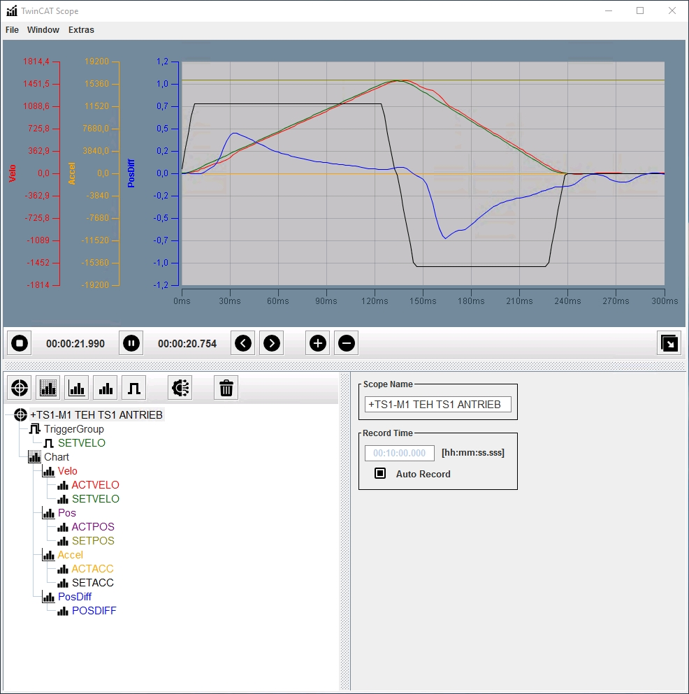
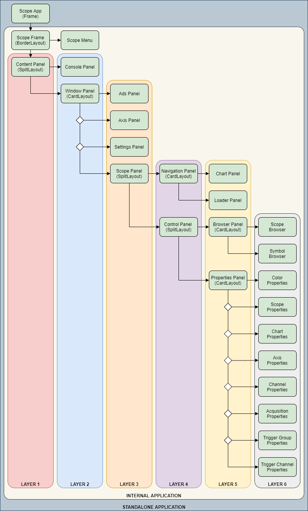

# TwinCAT Scope Application
This Application is based on the original TwinCAT 2 Scope View and is only available for TwinCAT 2. The **TcJavaToAds Java Library** depends on the **AdsToJava Dynamic Link Library** which makes it platform dependent. To utilize the Library a local TwinCAT 2 Installation is necessary. It can be integrated into a existing Project or used as a standalone Application.

# TwinCAT Scope Issues
Integration Problem with the AdsToJava Dynamic Link Library which is used for the Java Native Interface in the TcJavaToAds Library. The ADS Notification probably will be removed if the execution of the JNI Callback exceeds an unknown time limit. This problem could probably be fixed by replacing the original Library with a custom ADS TCP Library.

# TwinCAT Scope Documentation
- This project is classified as POC (Proof of Concept).
- There will not be added any additional Documentation or Integration Advice.

# TwinCAT Scope Overview

# TwinCAT Scope Application Layout

